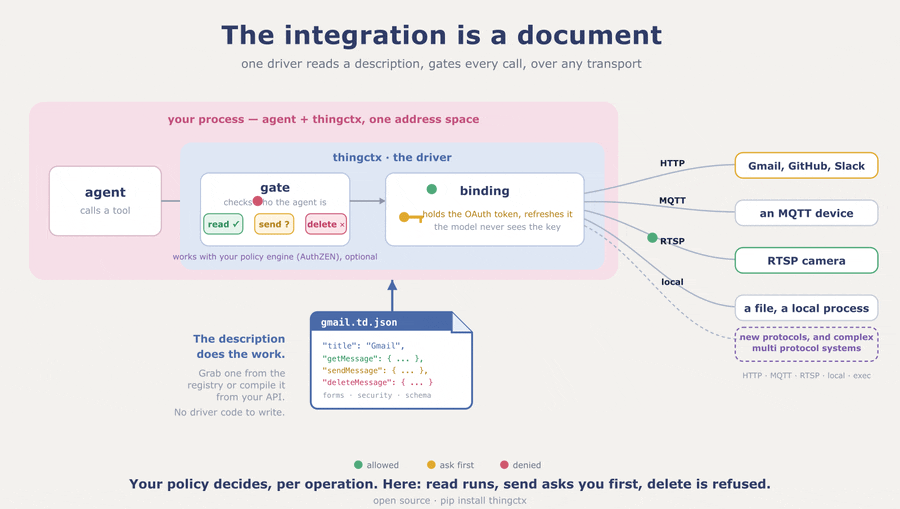

# thingctx

[](https://github.com/thingctx/thingctx/actions/workflows/ci.yml)
[](https://pypi.org/project/thingctx/)
[](https://pypi.org/project/thingctx/)
[](LICENSE)




**thingctx turns a description of any API, device, or local process into
tools an AI agent can call: authorized per operation, over the system's own
transport, and the agent never holds your keys.** The description is a
[W3C Web of Things](https://www.w3.org/WoT/) Thing Description (a TD), a
plain JSON file naming what the system can do. Write one, or compile it from
an OpenAPI spec. The described system is the server, so you run no server
per integration.

A "Thing" is whatever you want to describe: a REST API, an app, a sensor, a
media server, a local object, or one system that is several of those at
once. A media server takes commands over HTTP and serves its stream over
RTSP. The pump in [`examples/`](examples/) reads over MQTT and acts through
a local call. Each is one Thing and one description.

A description names `actions`, `properties`, and `events`, and gives each one
a form: the entry that says where and how to reach it. The URL scheme in that
address picks the transport per call, so however many protocols one Thing
spans, the agent still sees one tool set.

[`docs/BINDINGS.md`](docs/BINDINGS.md) covers the transports and how to add
your own. A subprocess transport, `exec`, also ships, and it ships locked:
it refuses every command until you hand it an explicit allowlist.

Those three stay distinct all the way to the call. A read, a write, and a
subscribe do not collapse into one undifferentiated function, which is why
the gate can allow the read and refuse the write on the same system. A flat
list of functions has no such handle.

Pick your path: [use it as a
library](#use-it-as-a-library) if you own the agent loop, [the command
line](#the-command-line) if you do not want to write code, [the MCP
bridge](#the-mcp-bridge) if your host only speaks MCP, or [add a
transport](#extend-it) if thingctx does not speak your protocol yet.

Stuck, or wondering whether something is possible? Ask in
[Discussions](https://github.com/thingctx/thingctx/discussions). Want to build
something small? The [open issues](#contributing) say what would help.

## First run: no keys, no network

One paste shows the whole idea. The description is inline and the handler
ships with the package, so nothing here needs a key, a network, or a second
file:

```bash
pip install thingctx
```

```python
import asyncio

import thingctx
from thingctx.contrib.time import make_time_handler

TD = {
    "@context": "https://www.w3.org/2022/wot/td/v1.1",
    "id": "urn:thingctx:time",
    "title": "Time",
    "securityDefinitions": {"nosec_sc": {"scheme": "nosec"}},
    "security": ["nosec_sc"],
    "actions": {
        "getCurrentTime": {
            "description": "Current time in an IANA timezone (default UTC).",
            "input": {
                "type": "object",
                "properties": {"timezone": {"type": "string"}},
            },
            "safe": True,
            "idempotent": True,
            "forms": [{"href": "local://getCurrentTime"}],
        }
    },
}


async def main():
    client = thingctx.ThingClient(
        tds=[TD], bindings=[thingctx.LocalBinding(make_time_handler())]
    )
    tools, invoke = client.as_tools()  # specs for your model; invoke runs a call
    print("tools:", [t["function"]["name"] for t in tools])
    print(await invoke("time__getCurrentTime", {"timezone": "UTC"}))


asyncio.run(main())
```

```
tools: ['time__getCurrentTime']
{'timezone': 'UTC', 'datetime': '2026-07-26T15:59:03.233080+00:00', 'utc_offset': '+0000'}
```

That is the whole loop: a description in, tools out, calls routed.
`LocalBinding` is a binding, a transport implementation; this one routes the
`local://` address to the handler you pass it. Every other transport works
the same way; only the form's `href` changes.

## Install

```bash
pip install 'thingctx[llm,http,validate]'
```

Quote the argument; unquoted brackets fail in zsh. Base
`pip install thingctx` has no dependencies; it already includes the `local`
and `exec` transports. Every optional transport and capability has an extra,
listed in [`pyproject.toml`](pyproject.toml); each one this page uses is
named next to the code that needs it.

## The document

A description can be small. This one drives the live, key free
[Open-Meteo](https://open-meteo.com) forecast API, so it runs as written.
Save it as `weather.td.json`, a later example uses it:

```json
{
  "@context": "https://www.w3.org/2022/wot/td/v1.1",
  "id": "urn:example:weather:v1",
  "title": "Weather",
  "securityDefinitions": { "nosec_sc": { "scheme": "nosec" } },
  "security": ["nosec_sc"],
  "actions": {
    "forecast": {
      "input": {
        "type": "object",
        "properties": {
          "latitude": { "type": "number" },
          "longitude": { "type": "number" },
          "current": { "type": "string" }
        },
        "required": ["latitude", "longitude"]
      },
      "forms": [{ "href": "https://api.open-meteo.com/v1/forecast", "htv:methodName": "GET" }]
    }
  }
}
```

thingctx projects each action to a tool named `<thing>__<action>`: this file
yields `weather__forecast` (a version segment on the id is dropped).
[`docs/MAPPING.md`](docs/MAPPING.md) specifies the full projection. The
description carries no secrets, so it is safe to commit and share. The
secret is supplied at runtime to the binding that carries the call. Secrets
are keyed per Thing.

If your system already has an OpenAPI 3.x spec, you do not have to author a
description at all:

```bash
pip install 'thingctx[openapi]'
thingctx import openapi https://api.example.com/openapi.json --out api.td.json
```

The spec can be a file or a URL, JSON or YAML; `--base-url`, `--id`, and
`--title` override what the spec says. The result is a normal description,
so everything else here applies to it unchanged.

Ready made descriptions for common apps, developer tools, and devices live
at [td.thingctx.com](https://td.thingctx.com).

## Use it as a library

Own the agent loop? Read descriptions, hand the specs to your model, and
route each call back through `invoke`. `ThingClient` needs no LLM and has no
opinion on what chose the action; any code can drive it. This sketch shows
the surface against a folder describing a pump; `from_arg` turns a path or
URL into a registry of descriptions:

```python
import thingctx


async def run():  # a sketch, not a program: call it from your own loop
    client = thingctx.ThingClient.from_registry(thingctx.from_arg("./descriptions/"))
    specs, invoke = client.as_tools()

    await invoke("pump__set_speed", {"rpm": 1500})
    await client.read_property("pump__rpm")
    await client.write_property("pump__target_rpm", 1500)   # gated like invoke
    async for evt in await client.subscribe("pump__overheat"):  # subscribe returns an async iterator
        ...
```

The form picks the transport per call, so one client can read over HTTP and
subscribe over MQTT. Bindings that pull optional dependencies, MQTT among
them, are off by default: install the extra and pass
`bindings=thingctx.BindingRegistry.default(mqtt=True)`.

Want the loop handled for you? The `llm` extra runs any provider through
litellm; add the `http` extra, since the weather file's form is HTTPS. Set
your provider key in its usual variable (`OPENAI_API_KEY`,
`ANTHROPIC_API_KEY`, and so on) and pick a model with `THINGCTX_MODEL`:

```python
import asyncio
import thingctx


async def main():
    # weather.td.json from above; it points at a live, key free API
    host = thingctx.from_file("weather.td.json")
    print(await host.chat("What is the forecast for Cairo? Latitude 30.0, longitude 31.2."))


asyncio.run(main())
```

The model calls `weather__forecast` itself and answers in prose:

```
The forecast for Cairo is clear, around 34 C.
```

## Safety: approval and authorization

Two opt in layers stand between an agent and a real system; both run
before any transport is selected. Neither layer handles a credential. The
binding holds the secret and the model never sees it.

**Approval** gates risky calls behind a human. Risk is read from the
description, and when to gate is yours: `declared` (only actions the
description marks risky; the default), `destructive` (adds non idempotent
actions and every property write), `all`, or `never`. A gated call with no
approver is denied: a gate with nobody to open it stays shut. The check sits
inside `invoke` and `write_property`, so it covers the LLM loop, direct
callers, and the MCP bridge alike.

Carrying on from the first example above, with the same `TD`:

```python
def approve(req):  # sync or async; return True to allow
    return input(f"run {req.tool_name}{req.arguments}? [y/N] ").lower() == "y"

client = thingctx.ThingClient(
    tds=[TD],
    bindings=[thingctx.LocalBinding(make_time_handler())],
    approve=approve,
    approve_when="all",
)
```

**Authorization** decides from policy, per caller, per operation. Pass a
`pdp` and an `identity` and every call authorizes the resolved
`(thing, affordance, operation)` before it reaches the system; an affordance
is an action, property, or event named in the description. This snippet condenses
[`examples/14_authz.py`](examples/14_authz.py), which runs as is on the core
install. It defines the `TD` and `Pump` used below: a pump with one
property, `target_rpm`.

```python
from thingctx import LocalBinding, ThingClient
from thingctx.authz import LocalPolicyGrantSource, PolicyDecisionPoint, build_vocabulary

reader = ThingClient(tds=[TD], bindings=[LocalBinding(Pump())])  # no pdp yet; parsed only to read the description
vocab = build_vocabulary(reader.things)  # the closed set the description declares

grants = LocalPolicyGrantSource(
    {"operator": {("urn:demo:pump", "target_rpm", "readproperty")}}
)
pdp = PolicyDecisionPoint(vocabulary=vocab, grant_source=grants)
identity = {"sub": "alice", "roles": ["operator"]}  # claims, validated upstream

client = ThingClient(
    tds=[TD], bindings=[LocalBinding(Pump())], pdp=pdp, identity=identity
)
```

Alice's `operator` role grants read on `target_rpm` and nothing else, so her
reads pass and her writes are refused. The vocabulary is closed: a grant is
honored only for operations the description declares. `thingctx.authz`
imports no crypto and runs on the dependency free core. Identity is claims
that something upstream validated, never the credential itself.

Running the example prints:

```
vocabulary (grantable tuples the TD declares):
  (urn:demo:pump, target_rpm, readproperty)
  (urn:demo:pump, target_rpm, writeproperty)

READ  target_rpm  -> ALLOWED, device returned 1200
WRITE target_rpm  -> DENIED, grant does not include ('urn:demo:pump', 'target_rpm', 'writeproperty')

RE-READ target_rpm -> 1200  (unchanged: the denied write never ran)
```

The full model is in [`docs/SECURITY.md`](docs/SECURITY.md).

## The MCP bridge

Some agents only take tools over MCP. For those, thingctx ships one generic
MCP server, with no per integration server. It serves any registry of
descriptions: a folder, a URL, or a W3C Thing Description Directory. A
Directory is the standard catalog server for descriptions.

```bash
pip install 'thingctx[mcp,http]'
thingctx-mcp ./descriptions/
```

For Claude Desktop, add this to
`~/Library/Application Support/Claude/claude_desktop_config.json`
(on Windows: `%APPDATA%\Claude\claude_desktop_config.json`) and restart:

```json
{ "mcpServers": { "things": {
  "command": "thingctx-mcp",
  "args": ["/path/to/your/descriptions/"],
  "env": { "THINGCTX_APPROVE_WHEN": "destructive" } } } }
```

The same approval gate applies here: the bridge marks risky tools and asks
the client to confirm. Declining denies the call. A client that cannot show
a confirmation dialog gets the call parked as pending instead, and the
bridge's `approve` tool confirms it from the chat.
`THINGCTX_APPROVE_WHEN` picks the policy, and `THINGCTX_POLICY` set to
`read-only` denies writes and state changing actions outright.

Descriptions never carry secrets, so the bridge reads them from the
environment: `THINGCTX_TOKEN_<SLUG>` binds a secret to the Thing with that
slug (`THINGCTX_TOKEN_GITHUB` serves `github`), applied per the Thing's
declared scheme.

## The command line

The `thingctx` command drives the same runtime from a terminal. Point `list`
and `invoke` at any folder of descriptions. Save the TD from the first run
above as `things/time.td.json`, then:

```bash
thingctx list ./things/
thingctx invoke ./things/ time__getCurrentTime --arg timezone=UTC
```

```
{
  "timezone": "UTC",
  "datetime": "2026-07-26T16:45:57.114817+00:00",
  "utc_offset": "+0000"
}
```

That works with no extra wiring because the clock's handler ships with the
package and binds to the `urn:thingctx:time` id in the description.

`list` prints every tool the folder's Things expose, with its schema;
`invoke` runs one action. `thingctx --help` lists the other subcommands,
including the OpenAPI importer shown above. `invoke` honors the same
approval gate. `--approve-when` picks the policy (`THINGCTX_APPROVE_WHEN`
is the fallback), `-y` approves without a prompt, and with no terminal and
no `-y` a gated call is denied with a non zero exit. An agent shelling out
gets the same protection as one holding the library.

## Extend it

Describing a new system needs nothing from this repo. Teaching thingctx
something it does not know yet is one class, and every part works the same
way, so what you learn once applies to the rest.

A transport is the common case:

```python
class CoapBinding:
    scheme = "coap"

    async def invoke(self, action, form, arguments): ...   # required
    async def read(self, prop, form): ...                  # optional
```

The contract is a `scheme` plus an async `invoke`. Add `read`, `write`, or
`subscribe` if the transport supports them; the runtime checks which methods
exist before calling, so a pub sub transport without reads simply has none.
Pass the binding to the client and it is live. Registering one for a scheme
thingctx already serves replaces the built in binding.

The same shape covers the rest:

| To teach thingctx | Implement | Prove it with |
|---|---|---|
| a new transport | `ProtocolBinding` | `assert_binding_contract` |
| a new way to authenticate | `CredentialProvider` | `assert_provider_contract` |
| a new place descriptions come from | `Registry` | `assert_registry_contract` |
| a new media engine | `MediaBackend` | `assert_media_backend_contract` |
| a new protocol to serve a fleet on | `GatewayBinding` | `assert_gateway_binding_contract` |

Each contract is a `typing.Protocol`: match the methods, inherit nothing.
`@implements(Contract)` checks the match at import time, and the conformance
kit in `thingctx.testing` checks the runtime behaviour a type checker cannot.
[`examples/13_custom_stack.py`](examples/13_custom_stack.py) builds one of
each in a single file, offline.

Keep what you write private in your own package, or contribute it so nobody
writes it twice. Out of tree packages register through entry points and are
discovered without a fork. See [`docs/BINDINGS.md`](docs/BINDINGS.md).

## Interoperability

thingctx consumes a description no matter who produced it. Demos under
[`examples/interop/`](examples/interop/) prove it end to end: Eclipse
Thingweb's [node-wot](examples/interop/nodewot/) serves a Thing and
thingctx drives it; Eclipse
[Ditto](examples/interop/ditto/) generates a description for a digital twin
and thingctx round trips state through it. The Thing Description is a W3C
Recommendation, so a file you write here is portable to any other WoT
consumer, and thingctx reads a W3C Thing Description Directory.

## Contributing

Driving your own system needs nothing from this repo: write a description
and point thingctx at it. What the project does need is transports it cannot
speak yet, and each one is a single class.

Good places to start:

- [good first issue](https://github.com/thingctx/thingctx/labels/good%20first%20issue)
  is scoped work with the context written down. Comment to claim one and it
  gets assigned to you.
- [help wanted](https://github.com/thingctx/thingctx/labels/help%20wanted) is
  everything else that is open.
- [CONTRIBUTING.md](CONTRIBUTING.md) explains how a binding fits together.

Contributor patches have added a lint rule and closed a coverage gap. Small,
scoped, merged.

Every commit needs a DCO `Signed-off-by` line, which `git commit -s` adds. AI
assisted patches are welcome; a real human reviews and signs off.

Questions do not need an issue.
[Discussions](https://github.com/thingctx/thingctx/discussions) is the place
for "does this already do X", "would you take a PR for Y", and how to reach a
system you have. Asking there is useful even when the answer is no, because
it tells the project what people are trying to do.

## License

Apache 2.0. See [LICENSE](LICENSE).
